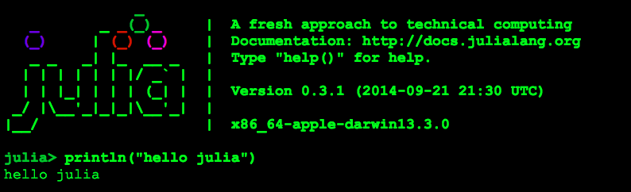

Advanced-Topics-Julia-101
=========================

Parse your data quickly and efficiently -- without breaking your bank.


> "Julia is a high-level, high-performance dynamic programming language for technical computing" 

-- the Julia docs

## Intro

<<<<<<< HEAD

=======
[!img](./.img/01_Julia_Terminal.png)
>>>>>>> ccb2c85235b0361cb90562c9970b0b84fd5a2e88

After downloading and opening Julia (which begins in a terminal), get your hello world started up:

```julia
println("Hello Julia")
```

Notice like python there is no `;`

## References


An IDE which we will be using to start:

* http://junolab.org/
